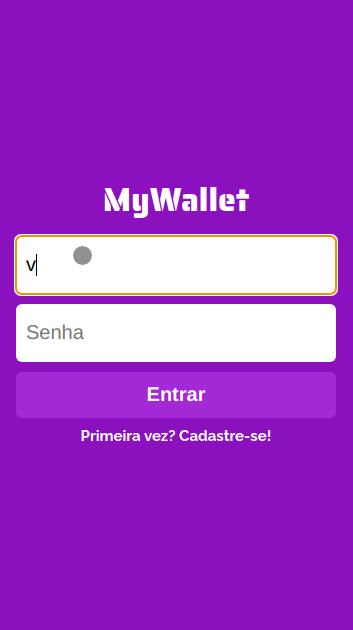

# MyWallet

</br>

<p  align='center'>
</br>

</p>
</br>
Try it out now at https://mywallet-front-henna.vercel.app/

## About

This is the back-end of an web application on which you can create an account and register your daily incomes and ravenues.

Features:

- Sign Up;
- Login;
- Main page that shows a list of financial events and the user's balance;
- Buttons for adding incomes or revenues;

## Technologies

The following tools were used in the construction of the project:<br>

<p>


</p>

## How to run

1. Clone this repository
2. Clone the front-end repository at https://github.com/leoguzi/mywallet-front
3. Follow instructions to run front-end at https://github.com/leoguzi/mywallet-front
4. Install dependencies

```bash
npm i
```

5. Create the database using the provided dump  (mywallet.sql).

6. Configure the environment variables using the .env.example file.

7. Run the back-end on development mode with:

```bash
npm run dev
```

8. Finally the API is up and ready to receive requests at port you configured at the .env file

9. You can alternatively access the API directly on https://gratiboxleo.herokuapp.com/

# Another information

Run the tests with:

```bash
npm run test
```
or

```bash
npm run test-watch
```

The production environment (npm start) is configured for the heroku deployment. If you wish to run in production locally you must edit the database.js file to point to a valid .env file following the .env.exemple.

# Routes Guide

Register a new user:

Post request to '/register' whit the body as follows:

```json
{
  "name": "User Name",
  "email": "user@email.com",
  "password": "userpassword",
  "passwordConfirm": "userpassword"
}
```

- The name must have at least 2 and less than 75 chars;
- The e-mail must be a valid e-mail;
- The password must be a string;
- The password confirmation must be identical to the password.

It will respond with status 201 if everything is ok, 409 if the e-mail is already used or 400 if any body field is invalid.

User login:

Post request to '/login' with the body as follows:

```json
{
  "email": "user@email.com",
  "password": "userpassword"
}
```

- The e-mail must be a valid e-mail;
- The password must be a string;

It will respond with status 400 if the body has any invalid field, 401 if the password is incorrect, 404 if the e-mail is not registered and 200 if sucess.

If everithing went fine this route will return you the user information as follows:

```json
{
  "name": "User Name",
  "token": "session token"
}
```

The token is an unique uuid and must be used to acces the protected routes.

User logout:

Post request to the '/logout' route with the body as follows:

```json
{
  "token": "session token"
}
```

It will respond with status 400 if the body has any invalid field, 404 if the token is not registered and 200 if sucess.

Register a new entry:

Post request to the 'entries' route with the configuration and the body as follows:

Cofiguration:

```json
"headers": {
  "Authorizarion": "Bearer sessionToken",
}
```

The token must be from a logged user.

Body:

```json
{
  "value": 2040,
  "description": "Entry description"
}
```

The value must be an integer diferent than 0, and must be in cents. If its an income the number must be positive, if its a ravenue it must be negative.

It will return 400 if any body field is invalid, 401 if the user is not logged in or the token is not provided and 201 if everything went fine.

Fetch user entries:

Get request to the '/entries' route with the configuration as follows:

```json
"headers": {
  "Authorizarion": "Bearer sessionToken",
}
```
It will return 401 if the user is not logged in or the token not provided and 200 if everything went fine. You can expect a objetc with all the entries from the logged user and the balance. Here is an example:

```json
{
    "entries": [
      {
        "value": -2400,
        "description": "Dinner"
      },
      {
        "value": -10000,
        "description": "Parking"
      },
      {
        "value": 5300000,
        "description": "Salary"
      }
    ],
    "balance":   5287600,
}
```

Feel free to contact me if you have any doubts or suggestions!
